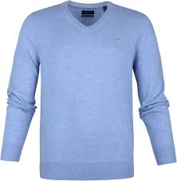

# Checkpoint 1

## Installation Works:


# Checkpoint 2

## 9000-9014 images:


## Modified Code:

```
num_rows = 5
num_cols = 3
num_images = num_rows*num_cols
plt.figure(figsize=(2*2*num_cols, 2*num_rows))
for i in range(num_images):
  # we want numbers starting from 9000:
  j = i + 9000
  plt.subplot(num_rows, 2*num_cols, 2*i+1)
  # pass in j and jth prediction:
  plot_image(j, predictions[j], test_labels, test_images)
  plt.subplot(num_rows, 2*num_cols, 2*i+2)
  # pass in j and jth prediction:
  plot_value_array(j, predictions[j], test_labels)
plt.show()
```

# Checkpoint 3

## Data:

### Shirt:


### Sandal:


### Dress:


### Pullover:




### Classifications:


## Code Snippets (full code in [check3.py](https://github.com/roryeiffe/oss-lab10/blob/master/check3.py)):

### Image Manipulation:

```
# Given a file name, parse image and convert it to grayscale, 
# resize it, invert it, and scale it down it:
def parse_image(image_name):
	# open the image and convert to gray scale:
	im = Image.open(image_name).convert('L')

	# convert to numpy array:
	im_array = np.array(im)

	# crop:
	dim = im_array.shape
	min_dimension = min(dim[0],dim[1])
	# get x and y offsets:
	x_offset = int(abs(min_dimension - dim[0])/2)
	y_offset = int(abs(min_dimension - dim[1])/2)
	# crop based on offsets:
	(left, upper, right, lower) = x_offset,y_offset,abs(x_offset-dim[0]), abs(y_offset-dim[1])
	im_crop = im.crop((left, upper, right, lower))

	# resize to be 28 by 28:
	im_crop.thumbnail((28,28))

	new_image_name = image_name[:-4] + "_gray_small.png"
	im_crop.save(new_image_name)

	# invert image:
	inverted_im = ImageOps.invert(im_crop)

	# Convert back to array so we can scale it down:
	im_array = np.array(inverted_im)

	# scale image between 0 and 1:
	final_im = im_array / 255.0

	# return the final image:
	return final_im
```

### Running the data through the model:

```
# Make a prediction on the images:

images = np.array([im1,im2,im3,im4])

# loop through images and print the classifications:
for i in range(len(images)):
	img = (np.expand_dims(images[i],0))

	# get the predictions:
	predictions_single = probability_model.predict(img)

	# print the predictions:
	print(predictions_single)

	# print the clothing index:
	clothing_index = np.argmax(predictions_single[0])
	print(class_names[clothing_index])
```
