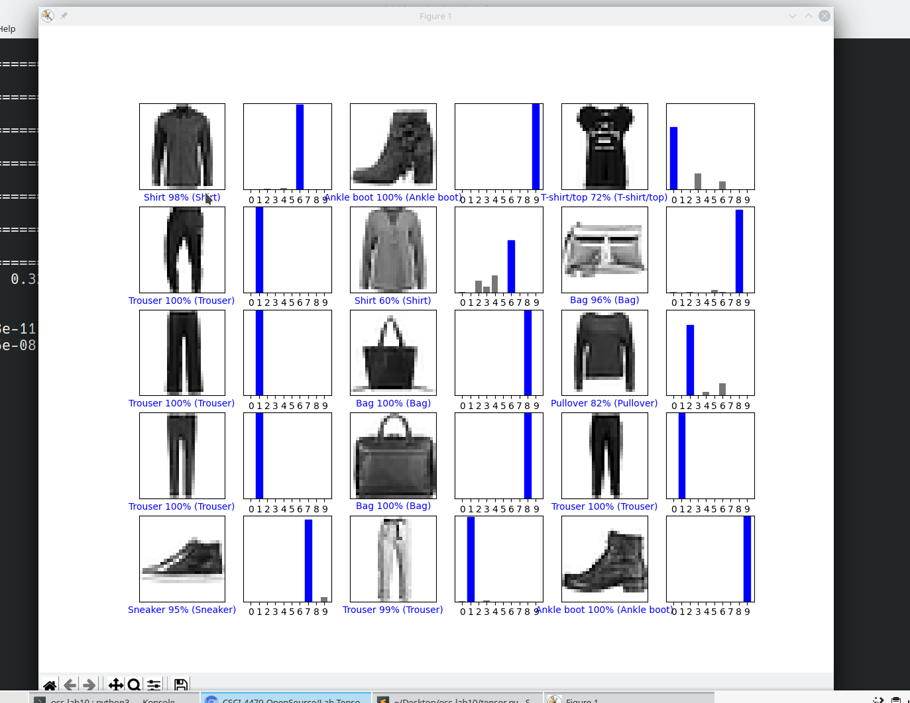

# Checkpoint 1

## Installation Works:


# Checkpoint 2

## 9000-9014 images:



## Modified Code:

```
num_rows = 5
num_cols = 3
num_images = num_rows*num_cols
plt.figure(figsize=(2*2*num_cols, 2*num_rows))
for i in range(num_images):
  # we want numbers starting from 9000:
  j = i + 9000
  plt.subplot(num_rows, 2*num_cols, 2*i+1)
  # pass in j and jth prediction:
  plot_image(j, predictions[j], test_labels, test_images)
  plt.subplot(num_rows, 2*num_cols, 2*i+2)
  # pass in j and jth prediction:
  plot_value_array(j, predictions[j], test_labels)
plt.show()
```

# Checkpoint 3

## Data:

### Shirt


### Sandal


### Dress


### Pullover


### Classifications:


